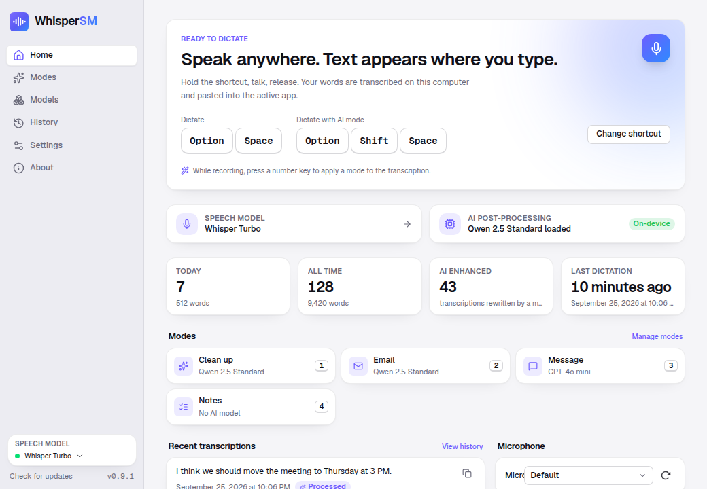

<p align="center">
  
</p>

<h1 align="center">WhisperSM</h1>

<p align="center">
  <strong>Private speech to text for macOS, Windows and Linux, with on-device AI post-processing.</strong><br />
  Hold a shortcut, speak, release: your words are typed into whatever app you are using.
</p>

<p align="center">
  <a href="https://github.com/Baptiste-Boin/WhisperSM/releases/latest">Download</a> ·
  <a href="#features">Features</a> ·
  <a href="#modes-ai-post-processing">Modes</a> ·
  <a href="BUILD.md">Build from source</a> ·
  <a href="RELEASING.md">Releasing</a>
</p>

<p align="center">
  
</p>

WhisperSM is a fork of [Handy](https://github.com/cjpais/Handy) (via [Parler](https://github.com/Melvynx/Parler)) with a redesigned interface, a bundled on-device language model runtime, professional installers and one-click updates from GitHub Releases. Everything runs on your computer: audio, transcription and AI rewriting never leave it unless you explicitly add a cloud provider.

## Features

- **Dictate anywhere.** One global shortcut (push-to-talk or toggle) pastes text into the active app. Number keys during a recording pick a mode.
- **Speech models that run offline.** Whisper (Small / Medium / Turbo / Large), NVIDIA Parakeet v2/v3, Moonshine, SenseVoice, GigaAM and Canary, with GPU acceleration (Metal on macOS, Vulkan on Windows/Linux).
- **Modes: AI post-processing.** Clean up, Email, Message, Notes and any custom prompt, rewritten by a model of your choice.
- **On-device AI, built in.** Download a 4-bit Qwen 2.5 or Llama 3.2 model (0.5B to 3B) from inside the app. Inference runs through [candle](https://github.com/huggingface/candle): Metal on Apple Silicon, multi-threaded CPU elsewhere. No Ollama, no API key.
- **Cloud providers, optional.** OpenAI, Anthropic, Groq, Gemini, OpenRouter, Cerebras, Z.AI, Apple Intelligence or any OpenAI-compatible endpoint with your own key.
- **History with audio.** Replay, re-transcribe or re-process any dictation.
- **Professional installers.** Signed DMG with drag-to-Applications layout, NSIS installer with per-user/per-machine choice and 13 languages, MSI, `.deb`, `.rpm` and AppImage.
- **Auto-update.** Builds published on GitHub Releases are picked up by running apps and installed in one click, with signature verification.
- **Localized.** 20 interface languages, French and English maintained first.

## Quick start

1. Download the installer for your platform from the [latest release](https://github.com/Baptiste-Boin/WhisperSM/releases/latest).
2. Install and launch WhisperSM. The onboarding wizard asks for microphone (and, on macOS, accessibility) permission, downloads a speech model and optionally an on-device AI model.
3. Put the cursor in any text field, hold the shortcut (`⌥ Space` on macOS, `Ctrl Space` on Windows/Linux), speak, release.

## Modes (AI post-processing)

A mode is a prompt plus the model that runs it. WhisperSM ships with four:

| Mode     | Key | What it does                                        |
| -------- | --- | --------------------------------------------------- |
| Clean up | 1   | Fixes punctuation, numbers, removes filler words    |
| Email    | 2   | Turns the dictation into a polite, structured email |
| Message  | 3   | Short, casual chat message                          |
| Notes    | 4   | Bullet-point notes                                  |

Trigger a mode by pressing its number key while recording, by assigning it a global shortcut, or use the _Dictate with AI mode_ shortcut (`⌥ ⇧ Space` / `Ctrl Shift Space`) which applies the first mode. Modes can also be applied afterwards from the History page.

### On-device models

| Model             | Params | Download | RAM   | Notes                               |
| ----------------- | ------ | -------- | ----- | ----------------------------------- |
| Qwen 2.5 Nano     | 0.5B   | 476 MB   | 4 GB  | Punctuation and basic cleanup       |
| Qwen 2.5 Standard | 1.5B   | 1.0 GB   | 8 GB  | Recommended, multilingual (FR/EN/…) |
| Qwen 2.5 Pro      | 3B     | 2.0 GB   | 16 GB | Best rewrites                       |
| Llama 3.2 Light   | 1B     | 787 MB   | 8 GB  | English-first                       |
| Llama 3.2 Pro     | 3B     | 1.9 GB   | 16 GB | English-first                       |

Models are fetched once from Hugging Face into the app data folder (`llm/<model>/`). They load lazily on first use and unload after the idle timeout configured in Settings › App.

## Development

```bash
bun install
mkdir -p src-tauri/resources/models
curl -o src-tauri/resources/models/silero_vad_v4.onnx https://blob.handy.computer/silero_vad_v4.onnx
bun run tauri dev
```

Useful scripts:

| Command                       | Purpose                                 |
| ----------------------------- | --------------------------------------- |
| `bun run lint` / `lint:fix`   | ESLint (enforces i18n for JSX strings)  |
| `bun run typecheck`           | TypeScript                              |
| `bun run format`              | Prettier + `cargo fmt`                  |
| `bun run check:translations`  | Every locale has every English key      |
| `bun run release:bump patch`  | Bump the version everywhere (see below) |
| `cargo test` (in `src-tauri`) | Rust unit tests                         |

See [BUILD.md](BUILD.md) for platform prerequisites and [CLAUDE.md](CLAUDE.md) for an architecture overview.

### Regenerating TypeScript bindings

Tauri commands are typed through `tauri-specta`. Bindings are exported automatically by `tauri dev`; to regenerate them without launching the app:

```bash
cd src-tauri && cargo test export_bindings -- --ignored
```

## Releasing and auto-update

```bash
bun run release:bump patch --tag   # bumps version, commits, tags vX.Y.Z
git push --follow-tags             # Release workflow builds and publishes
```

The workflow builds every platform, uploads the installers plus `latest.json` and publishes the release; installed apps update themselves. Signing-key setup is described in [RELEASING.md](RELEASING.md).

## CLI

WhisperSM keeps Handy's command-line flags for scripting and window-manager integration:

```bash
whispersm --toggle-transcription   # start/stop recording on the running instance
whispersm --toggle-post-process    # same, applying the default mode
whispersm --cancel
whispersm --start-hidden --no-tray
whispersm --debug
```

On Linux/Wayland you can also send `SIGUSR2` (toggle) or `SIGUSR1` (toggle with AI) to the process.

## Privacy

- Audio is captured locally and transcribed by a model on your machine.
- On-device AI models run inside the app. Nothing is sent anywhere.
- Cloud providers are used only for modes you explicitly point at them. API keys are stored in the local settings file.
- Update checks fetch a small JSON manifest from GitHub; they can be disabled in Settings › App.

## Credits

WhisperSM is built on [Handy](https://github.com/cjpais/Handy) by CJ Pais and the [Parler](https://github.com/Melvynx/Parler) fork by Melvynx, and uses [whisper.cpp](https://github.com/ggml-org/whisper.cpp), [transcribe-rs](https://github.com/cjpais/transcribe-rs), [candle](https://github.com/huggingface/candle), [Tauri](https://tauri.app) and the open-weight [Qwen 2.5](https://huggingface.co/Qwen) and [Llama 3.2](https://huggingface.co/meta-llama) models.

## License

MIT. See [LICENSE](LICENSE).
